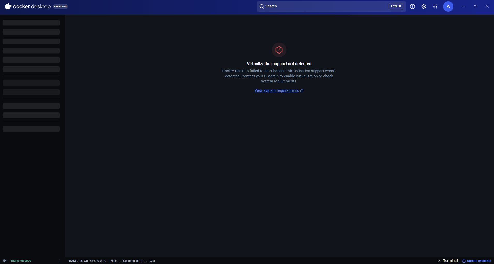
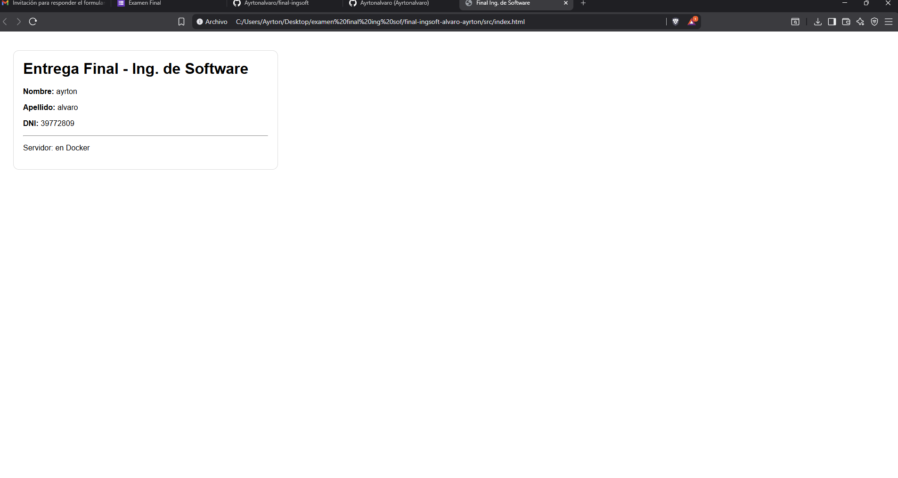

# final-ingsoft-apellido-nombre

Aplicación mínima que muestra Nombre, Apellido y DNI del alumno.

## Requisitos
- Docker
- Git

## Ejecutar sin Docker (opcional)
Abrir el archivo:
- `src/index.html` en el navegador

## 🐳 Docker

### Construir imagen
```bash
docker build -t final-ingsoft .


## Nota sobre ejecución de Docker

Durante el examen, tuve problemas con el docker desktop para iniciarlo debido a que la virtualización por hardware
no se encuentra habilitada en el equipo utilizado para rendir (mensaje:"Virtualization support not detected").

El Dockerfile y los comandos de build/run los defini correctamente,pero no puedo probarlo y
ejecutar el contenedor en tiempo real por restricciones del entorno.

El funcionamiento esperado del contenedor es:
- Build de la imagen con `docker build`
- Ejecución con `docker run -p 8080:80`
- Acceso vía navegador en `http://localhost:8080`

## Evidencias

### Error de Docker Desktop (virtualización deshabilitada)


### Aplicación HTML funcionando en local
